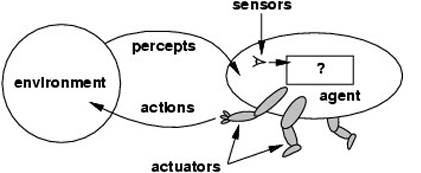
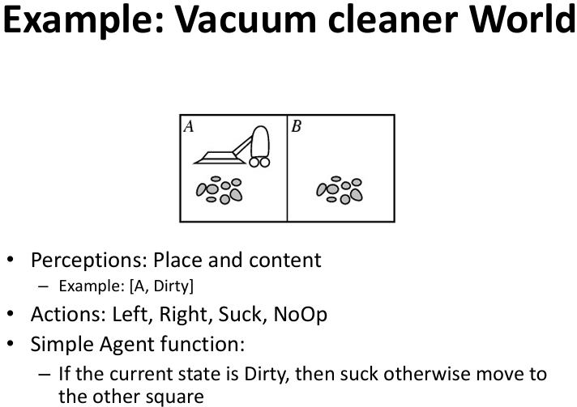
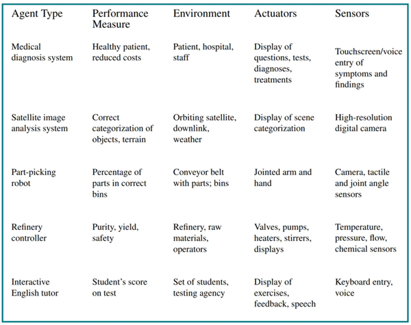

# Lecture 1 - Intelligent Agents

## Summary:
- An agent perceives and acts in an environment, has an architecture, and is implemented by an agent program.
- PEAS (Performance, Environment, Actuators, Sensors).
- The most challenging environments are inaccessible, nondeterministic, dynamic, continuous and multi-agent.
- Rational agent chooses the action which maximizes its expected performance, given its percept sequence so far.
- An agent program maps from percept history to action and updates internal 
state.
    - Reflex agents respond immediately to percepts (simple reflex agents, model-based reflex agents);
    - Goal-based agents act in order to achieve their goal(s);
    - Utility-based agents maximize their own utility function;
- Agents can improve their performance through learning.

## Concept 

Anything that can be viewed as **perceiving its environment through sensors** () and **acting upon that environment** through **actuators**.

- Sensors: cameras, infrared sensors, range finders, microphone, etc.
- Actuators: motors, wheels, speaker, etc.
- Agent = Architwcture + Program

## Intelligent Agents
- Rational Agents - The one who does the right/correct thing, a.k.a. one that makes agent more successfull(better peformance). \
↳ Given the percept sequence and agent’s built in knowledge \
↳ Rationality is distinct from omniscience



**Structures:**
AI task: Design the Program and Architecture for the Agent. \
Agents interact with environments through sensors and actuators, and the Internal Data Structures are updated using perceptions to make the decision of best action.



## The Nature of Environments: PEAS
- **PEAS**: Performance measure, Environment, Actuators, Sensors

The agent needs to know it's enviroment and task, therefore we must first specify the setting for intelligent agent design: Performance Measure, Environment, Actuators, Sensors.



ex: Agent - Taxi Driver Agent
- Performance measure: Safe, fast, legal, comfortable trip, maximize profits
- Environment: Roads, other traffic, pedestrians, customers
- Actuators: Steering wheel, accelerator, brake, signal, horn
- Sensors: Cameras, sonar, speedometer, GPS, odometer, engine sensors, keyboard

ex: Agent: Medical diagnosis system
- Performance measure: Healthy patient, minimize costs, lawsuits
- Environment: Patient, hospital, staff
- Actuators: Screen display (questions, tests, diagnoses, treatments, referrals)
- Sensors: Keyboard (entry of symptoms, findings, patient's answers)

ex: Agent: Part-picking robot
- Performance measure: Percentage of parts in correct bins
- Environment: Conveyor belt with parts, bins
- Actuators: Jointed arm and hand
- Sensors: Camera, joint angle sensors

## Properties of Environments
- **Accessible vs Inaccessible** - If the sensors detect everything that is relevant in the environment.
- **Deterministic vs Non Deterministic** – If the next state is determined by the previous state and the agent's actions.
- **Episodic vs Non Episodic** – Divided into episodes: Subsequent episodes do not rely on actions in previous episodes. (??)
- **Static vs Dinamic** – Dynamic if it changes while the agent is thinking.
- **Discrete vs Continuos** – Discrete if there is a finite number of perceptions and actions.
- **Single Agent vs multi-agent** – A single agent operating alone in the environment vs multi agents in the environment (cooperative or competitive).

examples:
![envCharac] (EnvCharac.png)

The **type** of the enviroment has a large influence on the agent design. An Simple enviroment would consist on: Full observable, deterministic, episodic, static, discrete and single-agent. But the real situations (mostly) consists in: <u>Partially observable, non-deterministic (stochastic), sequential, dynamic, continuous and multi-agent.<u>


## Intelligent Agents Architectures
### Simple Reactive/Reflex Agents
- Based on condition-action rules table (if-then rules)
- Table makes a direct link between current perception and action
- The agent works only if the environment is fully observable and the correct decision can be made based only on the current perception

![sreflexag] (SimpReflexAg.png)

### Agents with Representation of the World
- Model-based reflex agents
- Maintain an internal state (representation of the world)

![worldRepAg] (AgWE.png)

```
 FunctionAGENT-REACTIVE-With_World_Rep (Perception) returnsan Action
    Static Variables:
        State,  A description of the current world state
        Rules,  A set of condition-action rules
        Action, The most recent action, inicially empty
    State  ← UPDATES_STATE(State, Action, Perception)
    Rule   ← DETERMINES_RULES(State,Rules)
    Action ← RULE_ACTION(Rule)
    returns Action
```

### Objective-Based Agents
- Description of the state of the world and the objective to be achieved
- Example of an Objective: Getting from Porto to Lisbon
- Problem Solving by Search, Planning

![ObjectiveBasedAg] (AgOB.png)

### Utility-Based Agents
- Utility: Performance measure
- Kind of agent's degree of happiness! 
- Maps the current state to a value!

![UtilityBasedAg] (AgUB.png)

### Learning Agents
- Learning element and performance evaluation element
- Performance increases over time by using machine learning

![LearningAg] (AgL.png)

### BDI Agents
Three “mental attitudes”:
- **(B)eliefs** are information the agent has about the world – <u>information<u>
- **(D)esires** are all the possible states of affairs that the agent might like to accomplish – <u>motivation<u>
- **(I)ntentions** are the states of affairs that the agent has decided to work towards – <u>deliberation<u>

![LearningAg] (AgL=BDI.png)

## Multi-Agent Systems (MAS)
Composed by multiple agents that Exhibit autonomous behavior and Interact with the other agents in the system.
MAS Motivation:
- Natural Solution (distributed problems)
- Distributed knowledge or information
- Problem Dimensions
- Human-machine interface
- Project clarity and simplicity
- Legacy Systems
- Efficiency
- Robustness and Scalability
- Problem division
- Information privac

> Amount of 38 slides