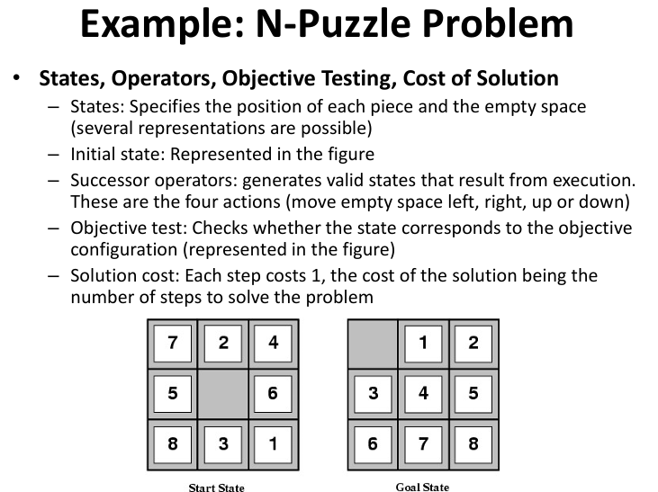

# Lecture 2.1 - Introduction to Search
The agent in a problem solving using search tries to find the <u>sequence of actions<u> (solution) that leads to the goal. The Problem Formulation consists on What are the possible actions and states, and how to evaluate them: **Formulate -> Search -> Execution**.
- The problem can be represented by a GRAPH, where the nodes represent states and the arcs (connections) the pairs of the transition relation. The solution would be the path between the initial state and the objective state.

## Problem Formulation:
Consistis in finding:
```
State Representation (State Space): Initial (Current) State and Possible Actions Set
Objective Test / Goal Testing: defines the desired states
Operators (Name, Preconditions, Effects, cost)
Solution Cost Function
```
There are 4 types of problems so the agent can have the knowledge of the state of the world:
- Single state problems: a.k.a. Well Defined Prob, deterministic and accessible environment
- Multiple state problems: deterministic but inaccessible environment
- Contingency problems: non-deterministic and inaccessible environment, sensors must be used during execution, solution is a tree or policy
- Exploration problems: unknown state space



> Amount of 24 slides
---

# Lecture 2.2 -Solving Search
The main logic/methodology to carry out the Solution search consists in:
1. Start with the initial state and Execute the goal test
2. If the solution was not found, use the operators to expand the current state generating new successor states (expansion)
3. Execute the objective test
4. If we have not found the solution, choose which state to expand next (search strategy) and carry out this expansion
5. Return to 2
And so on

The Search tree is composed by nodes, which have 5 components: State, Parent, Action/Operator (applied to generate it), Pathe Cost and Node depth. Leaf nodes either have no 
successors or have not yet been expanded.

## Search Strategies
The strategie is defined by the order of node expansion, along the following dimensions:
- Completeness: does it always find a solution if one exists?
- Time complexity: How long does it takes (total number of nodes generated)?
- Space complexity: How much memory it needs (maximum number of nodes in memory)?
- Optimality: does it always find the best (least-cost) solution?
Where the time and space complexity are mesured in terms of max branching factor of the tree (b), the depth of the least-cost solution (d), and the max depth of the state space (m).

The type can be divided in:
- Blind/Uninformed Search: Breadth First, Depth First, Uniform Cost, Iterative Deepening, Bidirectional Search
- Intelligent/Informed Search: Greedy Search, A* Algorithm

### BFS - Breadth-First Search
- Strategy: Nodes at lowest depth are expanded first
- Good: Very systematic search - util for small problems
- Bad: Usually it takes a long time and above all it takes up a lot of space
- Exponential complexity in space and time: O(b^d)

### DFS - Depth First Search
- Strategy: Always expand one of the deepest nodes in the tree
- Good: Very little memory required, good for problems with lots of solutions
- Bad: Cannot be used for trees with infinite depth, can get stuck in wrong branches
- Complexity in time O (b^m) and space O (b*m)
- Sometimes a limit depth is defined and it becomes a Search with Limited Depth

### Uniform Cost Search / Dijkstra
- Strategy: Always expand the border node with the lowest cost (measured by the solution cost function) 
- Breadth first  Search is equal to Uniform Cost Search if g(n) = Depth(n)

### IDS - Iterative Deepening Search
- Strategy: Mix of BFS and DFS, perform limited depth search, iteratively, always increasing the depth limit
- Complexity in time O(b^d) and in space O(b*d).
- In general it is the best strategy for problems with a large search space and where the depth of the solution is not known
### Bidirectional Search
- Strategy: Run forward search from the initial state and backward search from the target, simultaneously
- Good: Can greatly reduce complexity over time
- Has a lot of problems: Is it possible to generate predecessors? What if there are many objective states? How to do the "matching" between the two searches? What kind of search to do in the two halves?


### Greedy Search

### The A* Algorithm

> Amount of 45 slides
---

# Lecture 2.3 -Search Games

> Amount of _ slides