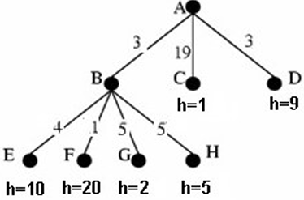

# 1.3 Strategies for Uninformed/Informed Search 

Assuming the following search tree in which each arc displays the cost of the corresponding operator, and the nodes contain the value of the heuristic function, indicate justifying, which node is expanded next using each of the following methods:

## Breadth-First Search
## Depth-First Search
## Uniform Cost Search 
## Greedy Search  
## A* Algorithm Search