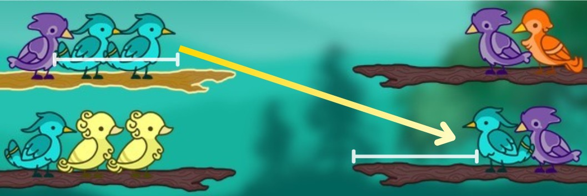
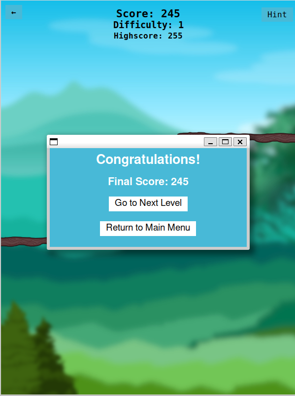

# Bird Sort - Color Puzzle
## Group A1-88
33.3% - up202208429 Luís Martim \
33.3% - up202208511 Tiago Teixeira \
33.3% - up202300600 Yuka Sakai

# Index
- [Game Description](#game-description)
- [How to Play / Rules](#how-to-play--rules)
  - [Branch Space](#branch-space)
  - [Moving a Bird](#moving-a-bird)
  - [Moving a Group of Birds](#moving-a-group-of-birds)
  - [Forming a Sequence](#forming-a-sequence)
  - [Level Completion](#level-completion)
- [Setup and Execution](#setup-and-execution)
  - [Requirements](#requirements)
  - [Execution](#execution)
- [Features](#features)
- [AI Features](#ai-features)
- [Algorithms](#ai-algorithms)
- [Conclusions from Algorithms](#conclusions-from-algorithms)
- [Art](#art)

## Game Description
Bird Sort is a single-player puzzle game inspired by color sorting mechanics. Your objective is to sort birds of the same color into individual branches by moving them one at a time, following a set of simple rules. The game challenges your logical thinking and strategic planning as the difficulty gradually increases with each level. 

   
  <em>Figure 1: Main Menu</em>

\
\
Navigating through the game is simple and intuitive. After opening the game you are presented with the Main Menu.
- **PLAY**: allows you to play the Human Game Mode, where the user can play through each randomized level and reach the highest score!
- **AI**: opens the AI Sub-Menu, presenting the 6 algorithms we have implemented.
  - This menu is very direct and user-friendly. There is also an Info Page inside this Sub-Menu to aid the user in case of questions on interface usage!
- **QUIT**: allows the user to quit the game.
- **INFO**: opens an About Us page with some relevant information about the project.

## How to Play / Rules
In order to solve the color puzzle, we defined a set of rules for you to follow and understand before you start playing!

### Branch Space
Each branch can hold up to 4 birds. If all birds in a branch are of the same color, that color along with this branch are removed from the puzzle.

### Moving a Bird
To move a bird from one branch to another:
- The **destination branch** must either be **empty** or have **enough space**.
- If not empty, the **top bird** on the destination branch must be the **same color** as the bird being moved.

   
  <em>Figure 2: Moving a single bird</em>

### Moving a Group of Birds
This rule follows the same principles as above, with one addition:
- Birds of the **same color**, if **stacked together**, **must move together** as a group.
- The destination must be either empty or have **enough space for the entire group**.

   
  <em>Figure 3: Moving a group of birds</em>

### Forming a Sequence
- Once **4 birds of the same color** are placed on the same branch, that branch **breaks**, increasing the player’s score.
- As mentioned in the first rule, both the **branch** and the **birds** are removed from the puzzle.

   
  <em>Figure 4: Breaking a branch with 4 same-colored birds</em>

### Level Completion
A level is completed when all branches have been cleared by correctly grouping and removing all birds of the same color. Once done, you'll be presented with options to either move to the next puzzle or return to the main menu.

   
  <em>Figure 5: Options displayed after finishing a level</em>

## Setup and Execution
Before running the game, ensure your environment is properly configured. Follow the steps below to install the necessary tools and dependencies.

### Requirements

- **Python 3.10 or higher**  
  - Download it from the [official Python website](https://www.python.org/downloads/)

- **Dependencies**  
  - Install the required Python package **Pillow/PIL** with pip: `pip install pillow`.

### Execution
To execute the game, navigate to **/code** and simply run `python3 main_menu.py`. 

## Features

- **Interactive Gameplay**
  - Move birds between branches based on simple, intuitive rules.
  - Group movements are enforced when birds of the same color are stacked.
  - Highlighted branches help track the currently selected branch.

- **Color-Matching Puzzle Mechanics**
  - Match four birds of the same color to break a branch and score points.
  - Requires strategic thinking to avoid deadlocks and optimize move efficiency.

- **Hints System**
  - Get assistance when you're stuck with a built-in hint system.
  - Highlights a possible valid move to help you progress without giving away the entire solution.

- **Score System**
  - Points are awarded for every successfully completed sequence.
  - Progress is tracked in Human Mode to encourage high-score chasing and replayability.

- **Visual Feedback**
  - Smooth animations and clear indicators for valid and invalid actions.
  - Distinct visual design for birds, branches, and UI elements.

- **Rule-Based Logic**
  - Strictly defined mechanics ensure fairness and consistent gameplay behavior.
  - Puzzle logic is transparent, making the game feel intuitive yet strategic.

- **Replayability**
  - Random puzzle generation guarantees a unique experience every time you play.

- **Challenging Yet Accessible**
  - Easy to learn, difficult to master — with increasing complexity at higher levels.

## AI Features

- **Multiple Algorithms**
  - Includes a variety of AI approaches to solve puzzles (DFS, BFS, A*, and more!)

- **Game State Control**
  - Supports puzzle generation by difficulty level or direct loading from `.txt` files.
  - Ideal for testing, benchmarking, or replaying specific puzzle states.

- **Statistics Display**
  - Tracks AI performance metrics such as number of moves, search depth, and execution time.
  - Helpful for comparing and analyzing algorithm efficiency.

- **Step-by-Step Visualization**
  - AI moves are displayed one by one, allowing players to follow the decision-making process.
  - Great for debugging or learning how the AI thinks.

## AI Algorithms

In this Bird Sort game, we implemented several algorithms to solve the puzzles automatically. Each algorithm has its unique approach to find a solution, ranging from exhaustive search methods to heuristic-based optimizations. Below is a summary of the implemented algorithms and their logic:

- **DFS (Depth-First Search)**  
  The DFS algorithm explores the puzzle state space by diving deep into one branch of the search tree before backtracking. It uses a stack to keep track of states and explores all possible moves from the current state until a solution is found or all possibilities are exhausted. While DFS is memory-efficient, it may not always find the shortest solution (very noticeable at high difficulty levels).

- **BFS (Breadth-First Search)**  
  BFS explores the puzzle state space level by level, ensuring that the shortest solution is found. It uses a queue to manage states and systematically explores all possible moves from the current state before moving to the next level. However, BFS can be memory-intensive as it stores all states at the current depth.

- **IDS (Iterative Deepening Search)**  
  IDS combines the depth-first search's low memory usage with the breadth-first search's completeness. It incrementally increases the depth limit, performing a depth-limited search at each level. This ensures that the algorithm finds the shortest solution while avoiding excessive memory usage. IDS is particularly useful for puzzles with large state spaces where memory efficiency is critical.

- **A Star**  
  A* combines the benefits of DFS and BFS by using a heuristic function to guide the search toward the goal state. It calculates the cost of each state as `f_score = g_score + h_score`, where `g_score` is the cost to reach the current state and `h_score` is the estimated cost to reach the goal. A* guarantees the shortest solution if the heuristic is admissible.

- **Weighted A Star**  
  Weighted A* is a variation of A* that prioritizes speed over optimality. It modifies the cost calculation to `f_score = g_score + weight * h_score`, where the `weight` biases the search toward the goal state. This approach reduces the number of explored states but may not always find the shortest solution.

- **Greedy Search**  
  Greedy search focuses solely on the heuristic value (`h_score`) to decide the next move, ignoring the cost to reach the current state (`g_score`). It is faster than A* but does not guarantee an optimal solution. Greedy search is ideal for quickly finding a solution when optimality is not a priority.

Each algorithm is implemented with a consistent interface, allowing easy comparison of their performance and behavior.

## Conclusions from Algorithms
In our comparison of search algorithms in a game-solving context:
- A* provided the best balance of optimality and performance.
- Greedy and Weighted A* were faster but could return suboptimal solutions.
- DFS and IDS were memory-efficient, with IDS being complete but slower.
- BFS ensured optimality (in uniform-cost problems) but had high memory usage.

## Art
For this project, we decided to make our own assets for the game. Each bird art and branch were digitally drawn by us and all backgrounds were created using [Canva](https://www.canva.com/). \
Below is our sprite sheet for the game!

   
  <em>Figure 6: Birds and Branches</em>

